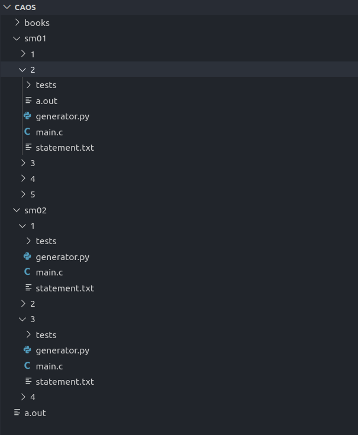

# caos-reborn

CLI для кокосика.

# Установка
 Просто выполняем 2 команды:

```
$ pip3 install caos-reborn
$ caos init
```

 После этого во стоит прописать:


 1) Свои данные на [ejudge](https://caos.ejudge.ru/) - ```$ caos login```

 2) Папку в который вы хотите хранить все такси - ```$ caos folder```

 Но это опционально тк фичи, которые используют эти данные и так потребуют их.

 Пока я нахожусь в стадии активной разработки также полезно выполнять:

 ```
$ pip3 install --upgrade caos-reborn
```

(обновлять библиотеку)

# Список команд

1. Страница help если что-то забудите

```$ caos help```

2. Вывести список нерешённых/всех задач. Выполняем команду

```$ caos status```


флаг `-s` или `--solved` для решённых (проверить pending review)

3. Вывести таблицу результатов. Достаточно бесполезно, но если вы уж решили совсем не заходить на caos.ejudge.ru, то лучше трекать результаты.

```$ caos info```

Теперь мощные фичи:

4. Синкануться с ejudge'ем. Для этого надо прописать ```$ caos folder```. Вас попросят ввести путь до папки, в которой вы хотите хранить все задачи с решениями.

Можно выкачивать данные контестов с [ejudge](https://caos.ejudge.ru/):

```$ caos sync```

Это создаст папки под все контесты, в каждом контесте папки под все задачи. Для каждой задачи создадутся файлы `*task_name*.c, generator.py`, а также папка `tests`.

Опциональные параметры:

```--sync-samples, -ssa``` - Выкачать семплы из условий в папку `tests`. По умолчанию они будут `000.dat` и `000.ans`.

```--sync-statements, -sst``` - Выкачать условия для каждой задачи по пути `contest/task/statement.txt`. В будущем можно будет вспомнить о чём задача, в настоящем можно лишний раз не заходить на сайт.

```--sync-all, -sa``` - Выкачать и семплы и условия. Объединяет параметры выше.



5. Запустить тестилку своих тестов. Она пробегается по всем файлам из папки `tests`, компилирует код на этих входных данных и сравнивает вывод с эталонным. Для этого, конечно, сначала надо сгенерить тесты (но можно и на семпле запустить).

Для запуска нам надо передать два параметра --- номер контеста и номер задачи в контесте (ниже будет пример)

```$ caos test -c sm02 -t 3```


Успешные тесты отмечаются ОКом, по упавшему тесту приходит инфа о первых 10ти различающихся строках.

6. Отформатировать код. Для этого нужно иметь установленный `clang-format`. (Все еще работает, но я еще не трогал в 2020) Запускаем:

```$ caos style --all```

чтобы отформатировать все исходники, лежащие в `CAOS_DIR` (в той же иерархии, которую создаёт ./caos
sync). Также можно указать путь до конкретного файла(-ов), чтобы отформатировать именно их.

Чтобы команда работала, должно быть соблюдено одно из следующих условий:

    1. Путь до `clang-format` указан явно при помощи флага `-t`. Например:
    ```./caos style --all -t /path/to/clang-format```

    2. Путь до `clang-format` был ранее записан в конфиг следующим образом:
    ```./caos style --set-tool /path/to/clang-format```

    3. `clang-format` лежит в директории, которая есть в переменной окружения `$PATH`

Приоритет выбора тулы ровно такой, как в списке выше, то есть, если у вас в конфиге уже прописан путь
до `clang-format`, и вы используете флаг `-t`, будет применён именно тот `clang-format`, который
прописан с помощью `-t`.

Работает с `clang-format` версии 8+.

# FAQ

### - Где хранятся данные?

Ваш и логин и пароль хранятся локально в вашем компьтере в папке ```.../python3.*/site-packages/caoslib/files/config.ini```, которая лежит с остальными библиотеками в вашем питоне.

Информация об активной сессии с edjude так же храниться там

### - После установки через pip не находит команду caos

Возможно у вас беды с питоновскими bash скриптами (Скорее всего они не находятся в `$PATH`).

Быстро пофиксить эту проблему можно просто закинув файл caos из этого репозитория в папку, которая входит в `$PATH` (Например в ```/usr/local/bin```)

# Комент автора

Изначально сделано @DoomzD. Сейчас поддерживается @hi_melnikov. По любым вопросам/предложениям пишите в тг.
